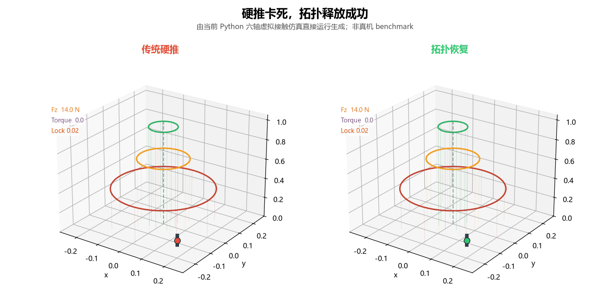

# TopoEmbodiedLoop

<p align="center">
  
</p>

<p align="center">
  <em>Generated by directly executing the current Python virtual 6-axis contact simulation. Synthetic no-hardware demo, not a real-robot benchmark.</em>
</p>

A compact open-source demo of a **topological perception-memory-control loop** for contact-rich embodied intelligence.

The goal is simple: when a robot is doing insertion, assembly, or contact-rich manipulation, it should not just keep pushing. It should detect contact risk, slow down or release early, and reuse past recovery experience.

## What this demo integrates

This simplified version combines the core ideas of five prototypes:

| Prototype idea | Public compact module | Role |
|---|---|---|
| DualWave | `modules/reliability_gate.py` | Decide which sensor stream is more trustworthy. |
| TopoWave | `modules/contact_reasoner.py` | Estimate contact states such as `contact`, `slip`, `jam`, `release`. |
| TopoClosedLoop | `TopoReasoner` + `TopoGuard` | Stabilize contact belief and trigger safe emergency modes. |
| TideMemory | `modules/topo_memory.py` | Recall similar contact episodes and bias recovery strategy. |
| VTEC | `modules/dual_topology.py` + `modules/contact_controller.py` | Track public dual-topology hints and perform low-force insert, release, recapture, and retreat actions. |

The loop is:

```text
sensor reliability -> contact belief -> dual-topology hint -> memory prior -> emergency guard -> contact action
```

## Why this matters

Modern embodied AI systems can often understand the target, but contact remains hard:

- the robot inserts slightly off-axis,
- contact turns into slip or jam,
- force rises before the policy reacts,
- recovery direction is chosen randomly,
- similar failures are not remembered.

The small virtual demos in this repository tell the same story in a reproducible way: a hard-push policy can look reasonable until the final contact stage, where force and torque rise quickly; the topology-aware loop instead slows down, releases laterally, and then recaptures the insertion path.

This demo is a small reflex layer for those cases. It is meant to complement high-level VLM/VLA policies, not replace them.

## Run

```bash
python run_demo.py
```

No third-party dependency is required.

## Compared strategies

| Strategy | Meaning |
|---|---|
| `reactive` | Uses current noisy state probabilities directly. |
| `reasoner_guard` | Adds temporal contact belief and emergency guard. |
| `full_loop` | Adds episodic memory to bias release strategy. |

## Example result

A representative run over 160 synthetic contact-rich episodes:

> Note: These results are from a lightweight synthetic benchmark for structural validation, not from real robot experiments.

| Strategy | Success | Avg peak force | Avg impulse | Avg jam steps |
|---|---:|---:|---:|---:|
| `reactive` | 2.5% | 104.55 | 76.15 | 7.49 |
| `reasoner_guard` | 88.1% | 53.32 | 23.47 | 1.52 |
| `full_loop` | 98.8% | 49.21 | 20.63 | 0.47 |

Compared with `reactive`, the full loop reduces peak force by about 53% and jam steps by about 94% in this synthetic setting. Compared with `reasoner_guard`, the memory-enabled loop further improves repeated-scene recovery by reusing successful directions and avoiding previously failed release directions.

## Outputs

The demo writes:

- `results/summary.csv`
- `results/summary.json`

For a synthetic 3D/6-axis force-torque trace:

```bash
python animate_virtual_6axis_demo.py
```

This writes:

- `results/virtual_6axis_demo.csv`

The CSV is a lightweight numeric trace for inspection. For visual presentation, use the GIF renderers below.

Optionally, render the 6-axis simulation directly as GIFs for README/social sharing. These renderers execute the current Python simulation logic in memory and do not read a pre-generated CSV file:

```bash
py -m pip install -r requirements.txt
python render_topology_escape_gif.py
```

This writes:

- `results/topology_escape.gif`

For a more presentation-friendly side-by-side GIF:

```bash
python render_topology_story_gif.py
```

This writes:

- `results/topology_escape_story.gif`

For a 3D lock-insertion style story GIF:

```bash
python render_topology_3d_story_gif.py
```

This writes:

- `results/topology_escape_3d_story.gif`

The GIF renderers are optional. The core benchmark and 6-axis trace remain standard-library only.

## Plain-language explanation

`reactive` is like a rushed robot that keeps pushing until it sees a jam.

`reasoner_guard` is like a cautious technician that notices contact risk trends and backs off before force spikes.

`full_loop` is like an experienced technician that also remembers which release direction worked in similar scenes.

## Scope and limitations

This is the public compact version. It is intentionally small and easy to inspect.

It is not:

- a production robot controller,
- a real robot benchmark,
- a full replacement for VLA/VLM policies,
- the complete research code of the original prototypes.

It is a minimal, reproducible demonstration of the loop structure.

## Suggested citation

If you use or discuss this prototype, cite it as:

```text
TopoEmbodiedLoop: A Topological Perception-Memory-Control Loop for Contact-Rich Embodied Intelligence, v0.1.0, 2026.
```

## License

This repository is released under a **source-available non-commercial research license**.

Allowed:

- academic research,
- personal study,
- non-commercial education,
- reproducibility evaluation,
- non-commercial demos.

Not allowed without written permission:

- commercial products,
- paid services,
- internal commercial deployment,
- sublicensing or selling the code,
- claiming the architecture, benchmark, or results as your own.

See `LICENSE` for details.
